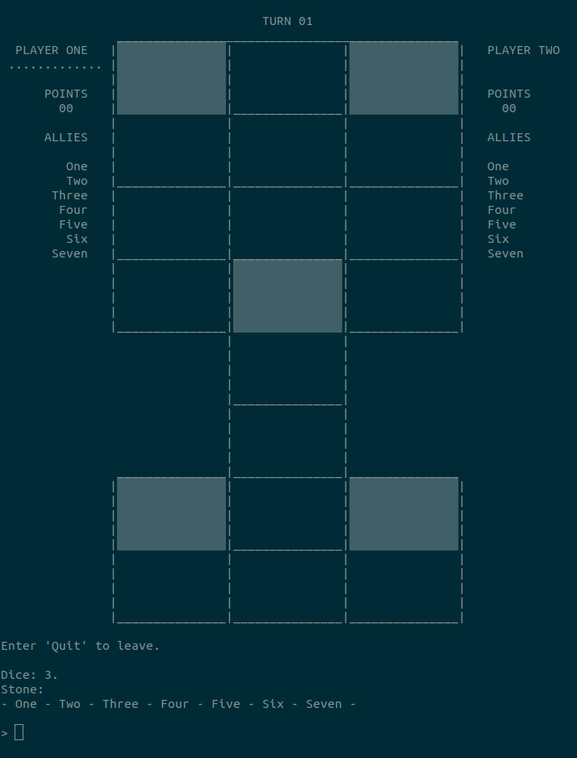

# Twenty Squares

**Project type:** PC video game.   
**Brief description:** Cross-platform video game for two local players.  
**Technologies:** C.  

*Twenty Squares* can also be found as a mini-game in Persistence. It's based upon the oldest game known to mankind: a five millenia old mesopotamian board game, known today as the Game of Twenty Squares or the Royal Game of Ur. Its purpose is to provide a "classic" version of the game, as well as a new take on it, that exploits possibilities brought by a computer.  

The game has four levels:
1. Classic Infinite.
2. Classic Dispatch.
3. Deadly Sins Infinite.
4. Deadly Sins Dispatch.

On these notes, I reserve special thanks to Irving Finkel of the British Museum and Tom Scott, who was his guest in the Museum's introductory video on the Royal Game of Ur. This video is how I came to learn of the game, and I've used the simple rules described in it to make the first level.  

